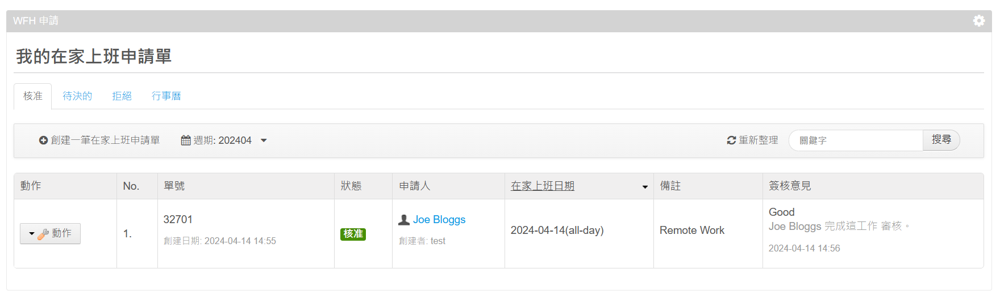
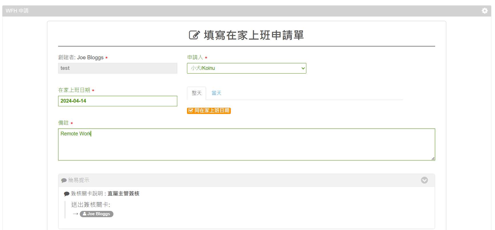
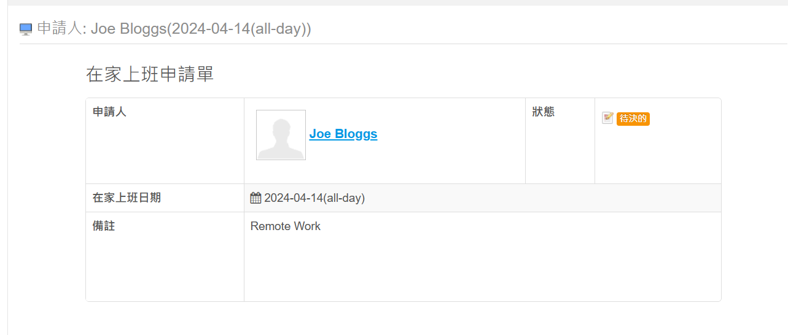

# Remote-Application-portlet

## Description
The Remote Application Portlet is a comprehensive tool designed for Liferay 6.2 that enables employees to apply for remote work directly through an intuitive online interface. This portlet streamlines the process of requesting remote work by automating the integration of approved requests into a shared calendar. This functionality not only allows employees to see who has applied for remote work but also facilitates the review and management of these requests by supervisors.

**Key Features:**

*   **Online Application Submission:** Employees can fill out and submit their remote work requests directly through the portal.
*   **Automatic Calendar Integration:** Once a request is approved, it is automatically added to a central calendar, visible to all employees, displaying who will be working remotely and when.
*   **Remote Work Review:** Supervisors have the ability to review remote work applications, approve or deny them, and manage scheduling conflicts effectively.

This portlet is designed to enhance workplace flexibility by making the process of applying for and managing remote work straightforward and transparent.

## Requirements
- Liferay 6.2 EE/CE
- Java 1.7
- Employee portlet

## Usage & Screenshots

Portlet Main View

Applying Remote Work

Displaying who is working remotely in Calendar View

Supervisor review remote work applications
